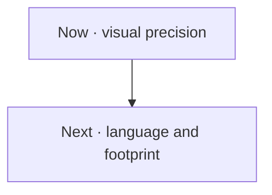

# Schemd roadmap

This is the active work queue for `@schemd/core`. It contains known limits, not release promises.

Priorities are simple: **P1** affects correctness or professional output; **P2** improves authoring, memory, or payload efficiency. Dependencies are guidance, not a lock.

Want to help? Open the claim link before starting a large change so work is not duplicated. A proposal must keep runtime dependencies at zero, the compiler at or below 30 KiB gzip, and coverage at 100%.

## Now · visual precision

- [ ] **P1-09 · Publish a deterministic typography contract.** Done when supported font behavior is explicit and long UML rows wrap or fail clearly instead of spilling or distorting. [Claim P1-09](https://github.com/schemd/core/issues/new?template=roadmap.yml&title=%5BROADMAP%5D%20P1-09%20%E2%80%94%20Deterministic%20typography)

## Next · language and footprint

- [ ] **P1-01 · Open the built-in symbol architecture.** Done when a typed registry owns parsing, ports, bounds, and primitives, and a published support matrix replaces broad “every diagram” claims. [Claim P1-01](https://github.com/schemd/core/issues/new?template=roadmap.yml&title=%5BROADMAP%5D%20P1-01%20%E2%80%94%20Built-in%20symbol%20registry)
- [ ] **P2-01 · Return serializer byte counts internally.** Done when the compiler consumes one internal `{ svg, bytes }` result and memory benchmarks cover the 2 MiB ceiling. [Claim P2-01](https://github.com/schemd/core/issues/new?template=roadmap.yml&title=%5BROADMAP%5D%20P2-01%20%E2%80%94%20Serializer%20byte%20result)
- [ ] **P2-02 · Hash document IDs incrementally.** Done when default SVG namespaces avoid a full JSON signature allocation and repeated diagrams have a documented unique-prefix path. [Claim P2-02](https://github.com/schemd/core/issues/new?template=roadmap.yml&title=%5BROADMAP%5D%20P2-02%20%E2%80%94%20Incremental%20document%20IDs)
- [ ] **P2-03 · Add delimiter escapes to the lexer.** Done when labels and options support bounded `\\`, `\"`, and `\;` escapes without a parser generator or regex backtracking risk. [Claim P2-03](https://github.com/schemd/core/issues/new?template=roadmap.yml&title=%5BROADMAP%5D%20P2-03%20%E2%80%94%20Grammar%20delimiter%20escapes)
- [ ] **P2-04 · Offer shared external styling.** Done when hosts can reuse one static style asset across many SVGs while self-contained output remains available. [Claim P2-04](https://github.com/schemd/core/issues/new?template=roadmap.yml&title=%5BROADMAP%5D%20P2-04%20%E2%80%94%20Shared%20external%20styling)

## How items leave this page

This file is an active queue, not a changelog. The PR that completes an item removes it here and from the [website timeline](https://johnowolabiidogun.dev/tools/schemd/docs/roadmap). Do not mark it complete and leave it behind. The merged issue, PR, and Git history preserve the record.
