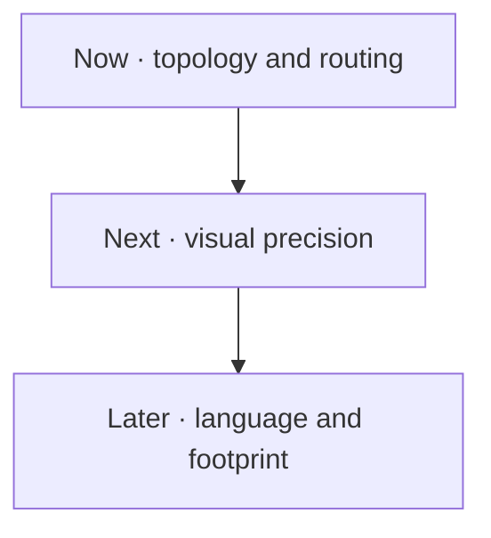

# Schemd roadmap

This is the active work queue for `@schemd/core`. It contains known limits, not release promises.

Priorities are simple: **P1** affects correctness or professional output; **P2** improves authoring, memory, or payload efficiency. Dependencies are guidance, not a lock.

Want to help? Open the claim link before starting a large change so work is not duplicated. A proposal must keep runtime dependencies at zero, the compiler at or below 30 KiB gzip, and coverage at 100%.

## Now · topology and routing

- [ ] **P1-02 · Add net and junction semantics.** Done when explicit nets and junctions split routed segments, shared junctions render once, and topologically separate crossings alone receive bridges. [Claim P1-02](https://github.com/schemd/core/issues/new?template=roadmap.yml&title=%5BROADMAP%5D%20P1-02%20%E2%80%94%20Net%20and%20junction%20semantics)
- [ ] **P1-04 · Reuse a document-level routing index.** Done when orthogonal routes query an interval index or visibility graph instead of rescanning every obstacle for every state and edge. Depends on P1-02. [Claim P1-04](https://github.com/schemd/core/issues/new?template=roadmap.yml&title=%5BROADMAP%5D%20P1-04%20%E2%80%94%20Document-level%20routing%20index)
- [ ] **P1-03 · Define collision rules for line and Bézier paths.** Done when manual opt-out behavior is explicit or straight and cubic paths are validated against components and topology-aware crossings. Depends on P1-02. [Claim P1-03](https://github.com/schemd/core/issues/new?template=roadmap.yml&title=%5BROADMAP%5D%20P1-03%20%E2%80%94%20Line%20and%20Bezier%20collision%20rules)
- [ ] **P1-08 · Detect accidental component overlap.** Done when an `O(V log V)` sweep rejects overlapping nodes while allowing explicit semantic containers. [Claim P1-08](https://github.com/schemd/core/issues/new?template=roadmap.yml&title=%5BROADMAP%5D%20P1-08%20%E2%80%94%20Component%20overlap%20validation)

## Next · visual precision

- [ ] **P1-05 · Route around wires and external labels.** Done when soft occupancy costs separate reusable channels and unrelated label bounds participate in obstacle queries. Depends on P1-04. [Claim P1-05](https://github.com/schemd/core/issues/new?template=roadmap.yml&title=%5BROADMAP%5D%20P1-05%20%E2%80%94%20Wire%20and%20label%20occupancy)
- [ ] **P1-06 · Make dense bridge clusters legible.** Done when close crossings retain a tangent gap, merge into one bridge, or emit a diagnostic instead of touching scalloped arcs. Depends on P1-02. [Claim P1-06](https://github.com/schemd/core/issues/new?template=roadmap.yml&title=%5BROADMAP%5D%20P1-06%20%E2%80%94%20Dense%20bridge%20clusters)
- [ ] **P1-07 · Remove marker background assumptions.** Done when UML paths are trimmed to transparent marker interiors and transformed marker bounds participate in collision checks. [Claim P1-07](https://github.com/schemd/core/issues/new?template=roadmap.yml&title=%5BROADMAP%5D%20P1-07%20%E2%80%94%20Background-independent%20UML%20markers)
- [ ] **P1-09 · Publish a deterministic typography contract.** Done when supported font behavior is explicit and long UML rows wrap or fail clearly instead of spilling or distorting. [Claim P1-09](https://github.com/schemd/core/issues/new?template=roadmap.yml&title=%5BROADMAP%5D%20P1-09%20%E2%80%94%20Deterministic%20typography)
- [ ] **P1-10 · Add visual and adversarial test gates.** Done when browser-rendered goldens, route properties, bounded fuzz cases, and mutation results catch geometry regressions alongside 100% code coverage. [Claim P1-10](https://github.com/schemd/core/issues/new?template=roadmap.yml&title=%5BROADMAP%5D%20P1-10%20%E2%80%94%20Visual%20and%20adversarial%20tests)

## Later · language and footprint

- [ ] **P1-01 · Open the built-in symbol architecture.** Done when a typed registry owns parsing, ports, bounds, and primitives, and a published support matrix replaces broad “every diagram” claims. [Claim P1-01](https://github.com/schemd/core/issues/new?template=roadmap.yml&title=%5BROADMAP%5D%20P1-01%20%E2%80%94%20Built-in%20symbol%20registry)
- [ ] **P2-01 · Return serializer byte counts internally.** Done when the compiler consumes one internal `{ svg, bytes }` result and memory benchmarks cover the 2 MiB ceiling. [Claim P2-01](https://github.com/schemd/core/issues/new?template=roadmap.yml&title=%5BROADMAP%5D%20P2-01%20%E2%80%94%20Serializer%20byte%20result)
- [ ] **P2-02 · Hash document IDs incrementally.** Done when default SVG namespaces avoid a full JSON signature allocation and repeated diagrams have a documented unique-prefix path. [Claim P2-02](https://github.com/schemd/core/issues/new?template=roadmap.yml&title=%5BROADMAP%5D%20P2-02%20%E2%80%94%20Incremental%20document%20IDs)
- [ ] **P2-03 · Add delimiter escapes to the lexer.** Done when labels and options support bounded `\\`, `\"`, and `\;` escapes without a parser generator or regex backtracking risk. [Claim P2-03](https://github.com/schemd/core/issues/new?template=roadmap.yml&title=%5BROADMAP%5D%20P2-03%20%E2%80%94%20Grammar%20delimiter%20escapes)
- [ ] **P2-04 · Offer shared external styling.** Done when hosts can reuse one static style asset across many SVGs while self-contained output remains available. [Claim P2-04](https://github.com/schemd/core/issues/new?template=roadmap.yml&title=%5BROADMAP%5D%20P2-04%20%E2%80%94%20Shared%20external%20styling)

## How items leave this page

This file is an active queue, not a changelog. The PR that completes an item removes it here and from the [website timeline](https://johnowolabiidogun.dev/tools/schemd/docs/roadmap). Do not mark it complete and leave it behind. The merged issue, PR, and Git history preserve the record.
